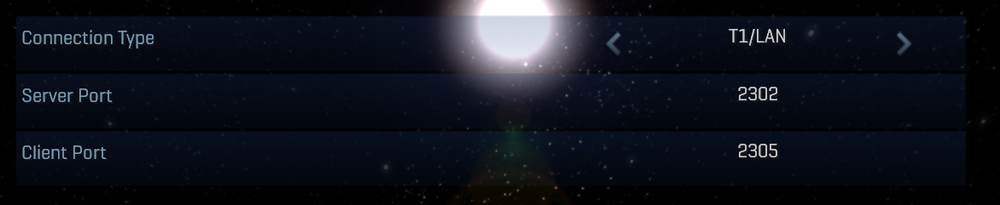

<html>
    <p align="center">
        
    </p>
    <p align="center">
        Cooperative Multiplayer adaptation of Singleplayer maps for Halo Custom Edition
    </p>
</html>

---

An adaptation and recreation of the campaign maps for Halo Combat Evolved, modified to work with
Halo Custom Edition adding support for an online multiplayer gameplay experience.

**NOTE:** This is not just 2 players or splitscreen coop project, this is a fully 16 players
over network project for **Halo Custom Edition 1.0.10**.

# Getting Coop Evolved
Get the latest version of the mod using the Mercury command:
```
mercury install coopevolved
```
And then you should be able to join any coop server you want, over LAN or Internet.

# How it works?
A campaign multiplayer project is not as easy as it probably sounds, it's indeed quite easy
but requires setup and a reinvention of the campaign mechanisms to work in multiplayer.

This project has different tools that can help in the procedure of adapting campaign maps to
multiplayer:
- [Mimic](https://github.com/Sledmine/mimic) - Core of all the synchronization mechanism for multiplayer
- **Mimic Adapter** - Tool capable of rewriting the campaign HSC scripts for compatibility with multiplayer
- [Harmony SAPP](https://github.com/JerryBrick/harmony) - A hook DLL provider to intercept script events for synchronization purposes via Mimic

# Known Issues
- AI/Bipeds do not hold weapons as they shoot (AI bipeds have weapons on the server side but their weapons are not syncing yet on the client side)
- AI/Bipeds appear to be "shaking" sometimes (this seems to be an issue with the Chimera FPS interpolation feature and the position of the AI being sync from the server)
- Vehicles in special pelicans, appear to shake in a similar way to AI (some vehicles like the pelicans are supossed to be in a state of levitation when no driver is inside the vehicle, this is common in campaign but the game netcode does not sync this levitation state in multiplayer)
- Low FPS depending on network ping, higher ping, less FPS (in summary this is caused due to the low rate of receiving AI data from the server, we are working on a solution for this)

# How can I mount my own coop server?
You have to download a modified and preconfigured version of the **Halo CE Dedicated Server**, this
modified version includes another mod called **SAPP**, it expands the legacy server functionality
including the patches and modifications required for the Coop Evolved mod to work.

You can install all the server files required using this Mercury command:
```
mercury install coopserver
```
**NOTE:** You have to install the coopevolved package as well!

## Running the server

After that you should be ready to go, just run the `haloceded.exe` in your root game folder and
it should display a terminal with your server running, you will see some messages like these:

```
-- Loading SAPP settings finished --
SAPP Version 10.2.1 CE by sehé°°, originally by Termy || halo.isimaginary.com
Successfully loaded sapp.dll!
sv_name: Coop Evolved Server
sv_maxplayers: 16
sv_public_value: 0
New Game, Map: a50_coop_evolved, Mode: coop
New bsp index detected: 0
halo(
```

Share your server IP to your friends and ensure you all are on the same network, your server is not
public to the internet unless you do another hard process to achieve that, try virtual local network
services as Hamachi or a VPN service like RadminVPN if you want to play over the internet for free.

If you want to connect to your own server locally (in the same machine that is hosting the server)
you will have to change these in game settings located on Settings/Network Settings, set them in
the same way as in the image from below:


With this configuration you can join to your server directly from the LAN servers menu, but careful,
you will lose the ability to host or load maps in LAN mode using the in game option, close your
local server `haloceded.exe` before doing that if that is the case.

**WARNING:** SAPP package hosted in the Mercury repository contains a modified version of
the **Halo CE Dedicated Server** that is capable of loading huge maps built with a custom [Invader](https://github.com/SnowyMouse/invader) build, also it uses different initialization files to allow installing it among
a Halo Custom Edition folder.

## Can I configure the server?
Yes! but there are a lot of parameters to set up, so I'll try to explain you the basic fields
you would like to play with, if you want to take a deeper look into how to configure your server,
check [this documentation](https://github.com/Sledmine/lua-blam/blob/master/SAPP_DOCS_2.5.pdf).

Edit the `load.txt` file in the root folder of your game, change the properties in there as needed, 
here is a short description of properties you should edit:
```lisp
sv_public 0
sv_name "Coop Evolved Server" ; Name for your server, choose whatever you want
;sv_password 1234 ; Enable a password for your server, players will have to use it to join
sv_rcon_password "1234" ; WARNING! Change this value asap, it is used to manage your server as an admin
sv_friendly_fire 1 ; (0 - default, 1 / off, 2 - shields, 3 - on)
sv_timelimit 0 ; Time limit for every play session (in minutes, 0 - no limit)
sv_motd motd.txt
sv_maxplayers 16 ; Max players allowed to connect to the server
allow_client_side_weapon_projectiles 0
game_difficulty_set impossible ; Game difficulty (easy, normal, hard, impossible)
sv_map a50_coop_evolved coop ; Map and gametype the server will run at load
set is_multiplayer true
load
```
**NOTE:** Only edit the fields that have comments on them, the other properties are set that way in
purpose.

# Can I contribute/help?
Of course! We need a lot of help to achieve this project, we have a workflow designed for contributions with support for people being added into the project development as soon as possible.
You can contribute with testing on our beta sessions or directly contributing with the map
content or code contributions.

Join us on our Discord server for more information: https://discord.shadowmods.net/
