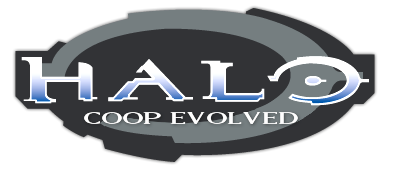
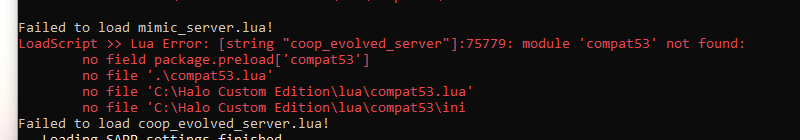
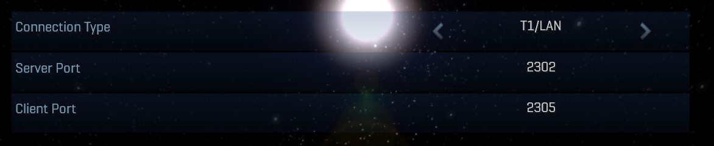
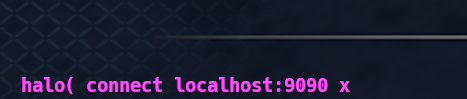

<html>
    <p align="center">
        
    </p>
    <p align="center">
        Cooperative Multiplayer adaptation of Singleplayer maps for Halo Custom Edition
    </p>
</html>

---

An adaptation and recreation of the campaign maps for Halo Combat Evolved, modified to work with
Halo Custom Edition adding support for an online multiplayer gameplay experience.

**NOTE:** This is not just 2 players or splitscreen coop project, this is a fully 16 players
over network project for **Halo Custom Edition 1.0.10**.

# Getting Coop Evolved
Get the latest version of the mod using the Mercury command:
```
mercury install coopevolved
```
And then you should be able to join any coop server you want, over LAN or Internet.

# How it works?
A campaign multiplayer project is not as easy as it probably sounds, it's indeed quite easy
but requires setup and a reinvention of the campaign mechanisms to work in multiplayer.

This project has different tools that can help in the procedure of adapting campaign maps to
multiplayer:
- [Mimic](https://github.com/Sledmine/mimic) - Core of all the synchronization mechanism for multiplayer
- [HSC to Lua Transpiler](https://github.com/Sledmine/mimic/blob/main/lua/scripts/hscToLua.lua) - Tool capable of rewriting HSC scripts into Lua code equivalent
- Conversion scripts - Other Lua scripts over the Mimic project to easily convert tags, AI data and more for a more friendly multiplayer environment

# Known Issues
- AI/Bipeds might not hold weapons as they shoot (some times AI bipeds that hold weapons on the server side might miss sync on the client side)
- AI/Bipeds appear to be "shaking" sometimes (this seems to be an issue with the Chimera FPS interpolation feature and the position of the AI being sync from the server)
- Vehicles that hover or are in special states (i.e pelicans), appear to shake in a similar way to AI (even when some special vehicle states are synced now, multiplayer does a lot of assumptions in vehicles that are not driven by players causing some weird behavior)
- Constantly getting kicked out from a network game, not being able to connect at all after starting the game (loading high quality assets and receiving extra network data is somewhat demanding for some PCs causing network connection to drop)

# How can I mount my own coop server?
You have to download a modified and preconfigured version of the **Halo CE Dedicated Server**, this
modified version includes another mod called **SAPP**, it expands the legacy server functionality
including the patches and modifications required for the Coop Evolved mod to work.

You can install all the server files required using this Mercury command:
```
mercury install -f luacompat53 sapp
```
**NOTE:** You have to install the `coopevolved` package as well, also make sure to be at least on
version 10.3.2 of SAPP or higher!


## Running the server
Running a server with mods loaded can be difficult to configure manually but to make this easier
Mercury has a command that launches a server for you with less configuration just by giving some
parameters, launch the server using:
```
mercury serve --mapcycle coop_evolved --scripts mimic_server coop_evolved_server
```
Where `mapcycle` is the list of precreated mapcycle list you want to load (under Halo CE/mapcycles)
and `scripts` is the list of scripts to load in the server to run, you can change these values to
whatever you want, but make sure mapcycles and scripts are compatible. (Mimic and Coop Evolved is a
must in this case)

Here is a list of all the maps available in the mod:

- a10_coop_evolved (The Pillar Of Autumn)
- a30_coop_evolved (Halo)
- a50_coop_evolved (The Truth and Reconciliation)
- b30_coop_evolved (The Silent Cartographer)
- b40_coop_evolved (Assault on the Control Room)
- c10_coop_evolved (343 Guilty Spark)
- c20_coop_evolved (The Library)
- c40_coop_evolved (Two Betrayals)
- d20_coop_evolved (Keyes)
- d40_coop_evolved (The Maw)

After that you should be ready to go, a terminal will appear displaying some messages like these:

```
-- Loading SAPP settings finished --
SAPP Version 10.2.1 CE by sehé°°, originally by Termy || halo.isimaginary.com
Successfully loaded sapp.dll!
sv_name: Coop Evolved Server
sv_maxplayers: 16
sv_public_value: 0
New Game, Map: a10_coop_evolved, Mode: coop
New bsp index detected: 0
halo(
```

If for any reason you encounter this error message:



Make sure that you have installed package `luacompat53` from Mercury prior to run the server.

**NOTE:** Server map will change automatically when finishing a game if you load it trough the
mapcycle option, you can type in the consele server to manually change the map using the command
`sv_map <map_name> team_slayer` in the server terminal or launching `mercury serve` again with the
new map name like: `mercury serve a10_coop_evolved coop --scripts mimic_server coop_evolved_server`

Share your server IP to your friends and ensure you all are on the same network, your server is not
public to the internet unless you do another hard process to achieve that, try virtual local network
services as Hamachi or a VPN service like RadminVPN if you want to play over the internet for free.

If you want to connect to your own server locally (in the same machine that is hosting the server)
you will have to change these in game settings located on Settings/Network Settings, set them in
the same way as in the image from below:


With this configuration you can join to your server directly from the LAN servers menu, but careful,
you will lose the ability to host or load maps in LAN mode using the in game option while your
local dedicated server is running, close your server `haloceded.exe` before doing that if that is
the case.

**NOTE:** Some users might have encountered a lot of issues to follow this configuration, if it does
not work, try to change the port used to host the server, just add `-p` at the end of the serve
command such as:
```
mercury serve --mapcycle coop_evolved --scripts mimic_server coop_evolved_server -p 9090
```

So players can connect trough the in game console using this command:
```
connect localhost:9090 x
```

Example:



Do not forget to replace "localhost" with your server IP if you are joining a server hosted outside
your network (a friend of your hosting it in another PC or similar).

**WARNING:** SAPP package hosted in the Mercury repository contains a modified version of
the **Halo CE Dedicated Server** that has a few bug fixes, is capable of loading huge maps built
with a custom [Invader](https://github.com/SnowyMouse/invader) build, also it uses different
initialization files to allow installing it among other mods that rely on the same files without
conflicting.

## Can I configure the server?
Yes! but there are a lot of parameters to set up, so I'll try to explain you the basic fields
you would like to play with, if you want to take a deeper look into how to configure your server,
check [this documentation](https://github.com/Sledmine/lua-blam/blob/master/archive/SAPP_DOCS_2.5.pdf).

**WARNING:** Keep in mind that command `mercury serve` previously mentioned creates a server from a
set of template files, everytime you launch the server trough this command, your server files will
get replaced, files stay untouched if you launch the server trough `haloceded.exe`.

If you still want to keep using the `mercury serve` command, there are a couple of parameters you
can specify to the command to change the server configuration, check the following command for
more information:
```
mercury serve --help
```

After the server has been created at least once, you can edit the server configuration, edit
`load.txt` file in the root folder of your game, change the properties in there as needed, 
here is a short description of properties you should edit:
```lisp
sv_public 0
sv_name "Coop Evolved Server" ; Name for your server, choose whatever you want
;sv_password 1234 ; Enable a password for your server, players will have to use it to join
sv_rcon_password "1234" ; WARNING! Change this value asap, it is used to manage your server as an admin
sv_friendly_fire 1 ; (0 - default, 1 / off, 2 - shields, 3 - on)
sv_timelimit 0 ; Time limit for every play session (in minutes, 0 - no limit)
sv_motd motd.txt
sv_maxplayers 16 ; Max players allowed to connect to the server
allow_client_side_weapon_projectiles 0
game_difficulty_set impossible ; Game difficulty (easy, normal, hard, impossible)
sv_map a50_coop_evolved coop ; Map and gametype the server will run at load
set is_multiplayer true
load
```
**NOTE:** It is HIGHLY RECOMMENDED to do not modify these fields and continue using `mercury serve`
for a more stable server configuration experience.

# Can I contribute/help?
Of course! We need a lot of help to achieve this project, we have a workflow designed for contributions with support for people being added into the project development as soon as possible.
You can contribute with testing on our beta sessions or directly contributing with the map
content or code contributions.

Join us on our Discord server for more information: https://discord.shadowmods.net/
